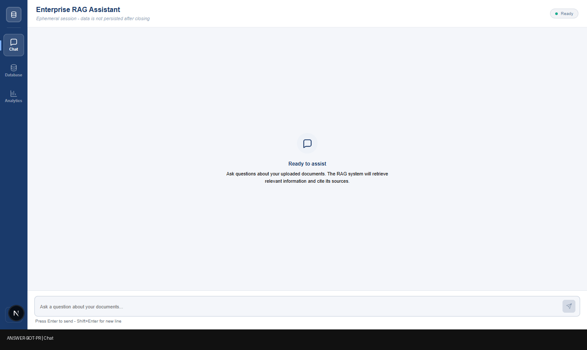
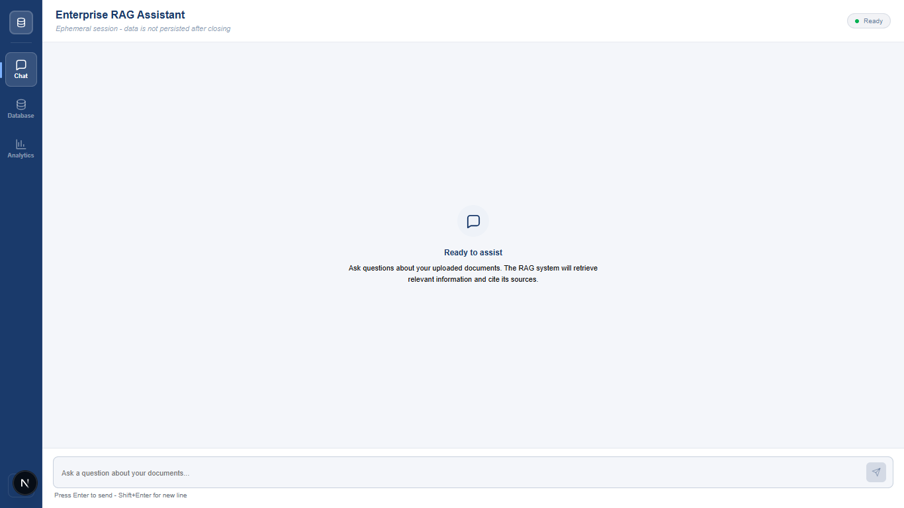
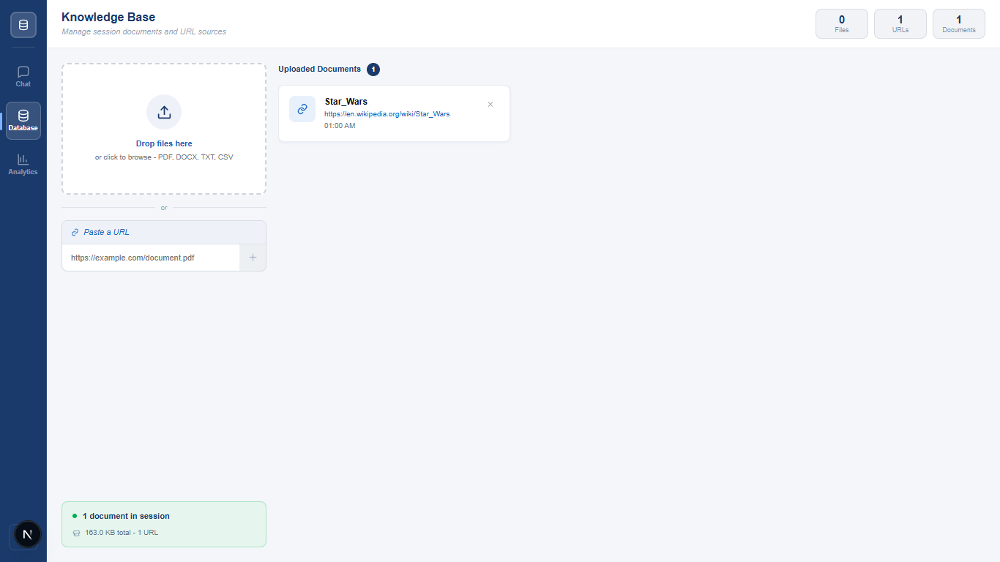
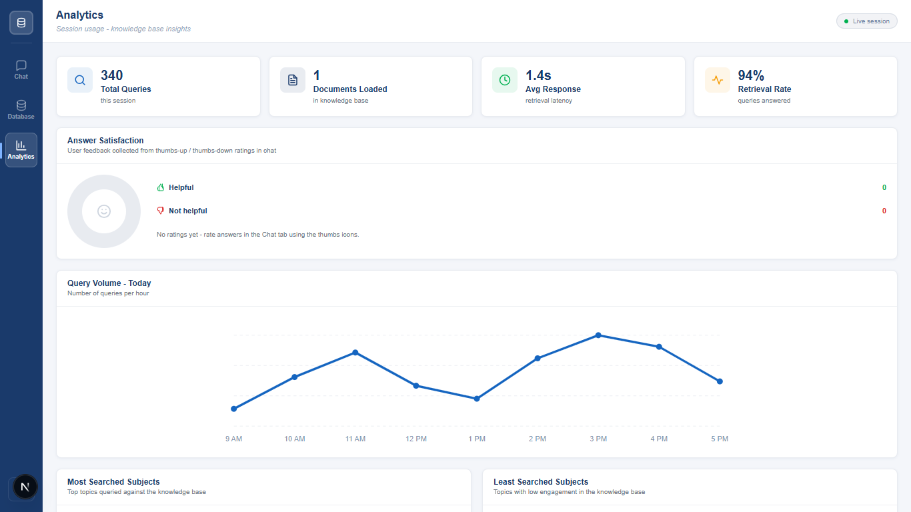

# ANSWER-BOT-PR

Enterprise RAG Assistant built with Next.js and Groq.

This project provides:
- A chat interface backed by a multi-model RAG pipeline
- A database tab to ingest knowledge sources (files and URLs)
- Retrieval over ingested sources only (no hidden fallback corpus)
- Analytics and feedback capture in the UI

## Quick Demo



### Screenshots





## Tech Stack

- Next.js (App Router)
- TypeScript
- Groq Chat Completions API
- In-memory knowledge base store (current implementation)

## Core Features

1. Database-backed RAG
- Upload text-like files (`.txt`, `.md`, `.csv`, `.json`, `.tsv`, `.log`)
- Add URL sources for text extraction
- Chat answers use only currently ingested Database content

2. Multi-model pipeline
- Retrieval + lexical/semantic hybrid scoring
- LLM grading pass for chunk relevance
- Model routing for generation:
  - `llama-3.1-8b-instant` for simpler prompts
  - `llama-3.3-70b-versatile` for complex prompts

3. Guardrails for limits
- History/context trimming and token budgeting
- Friendly error handling for Groq rate/token limit failures

## Project Structure

```text
app/
  api/chat/route.ts                 # Chat endpoint (retrieval + generation)
  api/knowledge-base/route.ts       # List/add/clear KB docs
  api/knowledge-base/[id]/route.ts  # Remove KB doc
  page.tsx                          # Main app shell + tab wiring
components/
  ChatPanel.tsx
  DatabasePanel.tsx
  AnalyticsPanel.tsx
lib/
  rag.ts                            # Chunking, scoring, retrieval, model routing
  knowledge-base.ts                 # In-memory KB ingest/store
```

## Prerequisites

- Node.js `>=20.9.0`
- npm
- Groq API key

## Environment

Create `.env.local` in project root:

```env
GROQ_API_KEY=your_groq_api_key_here
```

## Run Locally

```bash
npm install
npm run dev
```

Open:

```text
http://127.0.0.1:3000
```

## How to Use

1. Go to **Database** tab
2. Add one or more files/URLs
3. Go to **Chat** tab
4. Ask questions grounded in uploaded sources
5. Review cited source chips in responses

## API Routes

### `POST /api/chat`

Runs multi-model RAG against the currently ingested knowledge base.

Request body:

```json
{
  "query": "What are the key goals?",
  "history": [
    { "role": "user", "content": "..." },
    { "role": "assistant", "content": "..." }
  ]
}
```

Response body:

```json
{
  "answer": "Grounded response...",
  "model": "llama-3.1-8b-instant",
  "references": [
    {
      "id": "doc-id-1",
      "source": "source-name",
      "section": "Uploaded File",
      "quote": "snippet...",
      "score": 1.2345
    }
  ]
}
```

Common errors:
- `400`: missing query or empty knowledge base
- `404`: no relevant content found in current sources
- `500`: provider or server failure

### `GET /api/knowledge-base`

Returns all currently ingested documents.

### `POST /api/knowledge-base`

Ingest a source into the knowledge base.

Supported request types:
- `application/json` for URL ingest:

```json
{ "url": "https://example.com/doc" }
```

- `multipart/form-data` for file ingest with field name `file`

### `DELETE /api/knowledge-base`

Clears all documents from the in-memory knowledge base.

### `DELETE /api/knowledge-base/:id`

Removes one ingested document by id.

## Current Limits

- Knowledge base is in-memory (resets when server restarts)
- File parsing is text-focused (binary PDFs/DOCX not yet parsed)

## Troubleshooting

### 1) "Knowledge base is empty" in Chat

Cause:
- No sources are currently ingested.

Fix:
1. Open the **Database** tab.
2. Upload a supported file or add a URL source.
3. Retry the chat question.

### 2) Groq token/rate limit error (413 / rate-limit exceeded)

Cause:
- The request context or generation demand exceeded current Groq limits.

Fix:
1. Ask a shorter question.
2. Remove very large/irrelevant sources from Database.
3. Split large sources into smaller focused files.
4. Retry after a short wait if it is a temporary rate spike.

### 3) "No relevant content found"

Cause:
- Retrieval could not find enough matching content in ingested sources.

Fix:
1. Add more domain-relevant documents/URLs.
2. Rephrase the query using terms present in your sources.
3. Verify the expected text really exists in the uploaded content.

### 4) Unsupported file type on upload

Cause:
- Current ingestion is text-oriented.

Supported now:
- `.txt`, `.md`, `.csv`, `.json`, `.tsv`, `.log`

Fix:
1. Convert binary docs (PDF/DOCX) to text/markdown first.
2. Upload the converted file.

### 5) Data disappears after restart

Cause:
- Knowledge base is currently in-memory only.

Fix:
1. Re-ingest sources after restart, or
2. Implement persistent storage (SQLite/Postgres) as next step.

## Recommended Next Improvements

1. Persistent storage (SQLite/Postgres) for KB documents
2. Permission metadata + filtering layer per source/user
3. Streaming chat responses (SSE)
4. Observability (latency/token/cost traces)
5. Structured citation rendering with deep source snippets

## License

Private/internal use unless otherwise specified by repository owner.
